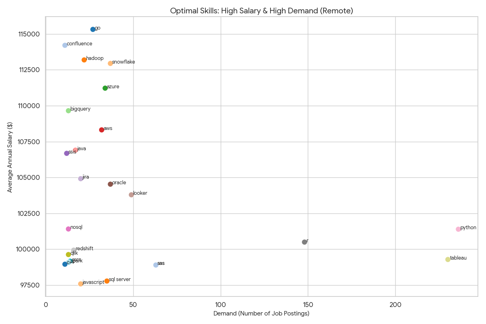

# Introduction
### 👋 Overview
Welcome to my analysis of the Data Analyst job market! 
This project digs into real-world job postings of 2023 to uncover insights 
about salaries, top-paying skills, and hiring trends.

### 🛠️ Attribution & Learning
This project was built as a **guided implementation** following the 
curriculum by **Luke Barousse**. It serves as a practical 
application of my data analysis skills, taking raw data and transforming it 
into actionable insights.

You can check all of my SQL queries out here:
[analysis_sql folder](/analysis_sql)
# Background
Driven by a desire to navigate the data analyst job market more effectively, 
this project dissects real-world job postings to uncover what truly 
matters to employers. 🕵️‍♂️

Data hails from this [SQL Course by Luke Barousse](https://lukebarousse.com/sql).

### Questions I wanted to answer through my SQL queries were:
1. What are the top-paying Data Analyst jobs?
2. What skills are required for these top-paying jobs?
3. What skills are most in demand for Data Analysts?
4. Which skills are associated with higher salaries?
5. What are the most optimal skills to learn?

# Tools used
For this project, I utilized a powerful tech stack to analyze the data and share my findings:

* **SQL ⚡️:** The backbone of my analysis! I used SQL to query the database, filter job postings, and extract critical insights about salaries and skills.
* **PostgreSQL 🐘:** The robust, open-source relational database management system chosen to store and manage the raw job market data.
* **DataGrip 🗄️:** My go-to IDE for database management. I used it to execute complex queries, inspect tables, and ensure my analysis was efficient and accurate.
* **Git & GitHub:** Essential for version control and collaboration. I used Git to track my changes and GitHub to share this project and its findings with the data community!

# The Analysis
Each query for this project aimed at investigating specific aspects of the data analyst job market.

Here is how I approached each question:

### 1. Top Paying Data Analyst Jobs
This query is designed to identify the top-paying remote Data Analyst roles. 
It retrieves the essential details for the 10 highest-paid job postings that 
are available remotely ("Anywhere").

```postgresql
SELECT
    job_id,
    job_title,
    job_location,
    job_schedule_type,
    salary_year_avg,
    job_posted_date,
    name AS company_name
FROM
    job_postings_fact
LEFT JOIN company_dim ON job_postings_fact.company_id = company_dim.company_id
WHERE
    job_title_short = 'Data Analyst' AND
    job_location = 'Anywhere' AND
    salary_year_avg IS NOT NULL
ORDER BY
    salary_year_avg DESC
LIMIT 10
```
Key Insights:
- Outlier at the Top: The highest-paying role at Mantys ($650k) is a 
massive outlier, nearly double the second-highest salary, 
likely due to equity or a niche requirement.
- Seniority Matters: High salaries are dominated by Director and Principal 
titles, showing that breaking the $200k+ ceiling usually 
requires leadership status.
- Remote Dominance: All top 10 roles are listed as "Anywhere", proving that 
top-tier compensation is available for fully remote talent.
- Diverse Employers: High pay isn't limited to big tech like Meta and AT&T; 
smaller, specialized companies like SmartAsset also pay premium rates.


*Bar graph visualizing the salary for the top 10 salaries
for data analyst*

### 2. Skills For Top-Paying Jobs
This query identifies the skills most frequently associated with the 
highest-paying remote Data Analyst roles. It first isolates the top 10 
highest-paying jobs and then joins them with skill data to reveal what 
technical competencies are in demand for these premium positions.

```postgresql
WITH top_paying_jobs AS (
    SELECT job_id,
           job_title,
           salary_year_avg,
           name AS company_name
    FROM job_postings_fact
             LEFT JOIN company_dim ON job_postings_fact.company_id = company_dim.company_id
    WHERE job_title_short = 'Data Analyst'
      AND job_location = 'Anywhere'
      AND salary_year_avg IS NOT NULL
    ORDER BY salary_year_avg DESC
    LIMIT 10
)
SELECT
    top_paying_jobs.*,
    skills
FROM
    top_paying_jobs
INNER JOIN skills_job_dim ON top_paying_jobs.job_id = skills_job_dim.job_id
INNER JOIN skills_dim ON skills_job_dim.skill_id = skills_dim.skill_id
ORDER BY
    salary_year_avg DESC
```
Key Insights:
- SQL & Python Dominance: SQL (8 mentions) and Python (7 mentions) 
remain the undisputed kings of data analytics, even at the executive level. 
Proficiency in these is non-negotiable for top-tier roles.
- Tableau for Visualization: Tableau (6 mentions) is the preferred visualization tool for 
high-paying roles, significantly outpacing Power BI in this specific top-tier dataset.
- Cloud & Big Data: The presence of Snowflake, Azure, AWS, and Databricks highlights that 
high-paying roles often involve working with modern cloud data warehouses and big data platforms.
- Excel Still Matters: Surprisingly, Excel still appears in the top skills, proving that even for 
roles paying $200k+, basic spreadsheet manipulation remains a core day-to-day need.


*Frequency of skills mentioned in the top 10 highest-paying remote Data Analyst 
job postings*

### 3. Most Demanded Skills
This query highlights the most popular skills for Data Analysts by counting the number of 
job postings that list each skill. It focuses on remote roles to show what technical 
competencies are most valuable for work-from-home opportunities.

```postgresql
SELECT
    skills,
    COUNT(skills_job_dim.job_id) AS demand_count
FROM
    job_postings_fact
INNER JOIN skills_job_dim ON job_postings_fact.job_id = skills_job_dim.job_id
INNER JOIN skills_dim ON skills_job_dim.skill_id = skills_dim.skill_id
WHERE
    job_title_short = 'Data Analyst' AND
    job_work_from_home = TRUE
GROUP BY
    skills
ORDER BY
    demand_count DESC
LIMIT 5
```
Key Insights:

- SQL is King: With over 7,000 mentions, SQL is by far the most requested skill. 
It is nearly indispensable for any remote data analyst role.

- Excel Remains Vital: Excel ranks second with 4,611 mentions, surpassing Python. 
This proves that despite the rise of advanced coding tools, traditional spreadsheets 
are still a cornerstone of data analysis.

- Python is Essential: While slightly behind Excel in pure volume (4,330 mentions), 
Python remains a top-tier requirement, highlighting the need for scripting and 
automation capabilities.

- Visualization Battle: Tableau (3,745 mentions) currently leads Power BI (2,609 mentions) 
in demand for remote analyst roles, though both are critical players in the BI space.

| Skills   | Demand Count |
|:---------|:-------------|
| sql      | 7291         |
| excel    | 4611         |
| python   | 4330         |
| tableau  | 3745         |
| power bi | 2609         |

*The top 5 most demanded skills for remote data analysts*

### 4. Top Paying Skills
This query identifies the skills that command the highest average salaries 
for Data Analyst roles. It filters for positions with listed salaries 
and calculates the average annual compensation for each skill, 
ranking them to highlight the most lucrative technical competencies.

```postgresql
SELECT
    skills,
    ROUND(AVG(salary_year_avg),2) AS avg_salary
FROM
    job_postings_fact
INNER JOIN skills_job_dim ON job_postings_fact.job_id = skills_job_dim.job_id
INNER JOIN skills_dim ON skills_job_dim.skill_id = skills_dim.skill_id
WHERE
    job_title_short = 'Data Analyst'
    AND salary_year_avg IS NOT NULL
GROUP BY
    skills
ORDER BY
    avg_salary DESC
LIMIT 25
```

Key Insights:
- Specialized & Niche Skills Command Premiums:
  - SVN tops the list at $400,000. Note that SVN (Subversion) is a legacy version control system. Its excessively
  high average salary likely reflects a specific, senior-level, or niche role (e.g., a legacy system migration
  expert or a high-level architect) rather than a broad market trend for the tool itself.
  - Solidity ($179,000) takes second place, highlighting the high value placed on blockchain and smart contract
  development skills within analytics roles.
- Shift Towards Engineering & DevOps:
  - Many top skills are traditionally associated with DevOps and Data Engineering rather than pure analysis.
  - Tools like Terraform (\$146k), Ansible (\$124k), Puppet (\$129k), GitLab, and Kafka ($130k) suggest that
  "Data Analysts" who can handle infrastructure, deployment pipelines, and streaming data are extremely valuable.
- AI & Machine Learning Frameworks:
  - There is a strong presence of deep learning libraries: MxNet (\$149k), Keras (\$127k), PyTorch (\$125k),
  Hugging Face (\$124k), and TensorFlow (\$120k).
  - DataRobot ($155k), an automated machine learning platform, ranks very high, indicating a premium on efficiency
  in building ML models.
- Programming Languages:
  - Beyond Python and SQL, languages like Golang (\$155k), Perl (\$124k), and Scala ($115k) are highly paid.
  This often correlates with roles that require handling high-performance systems or legacy codebases.
- Collaboration Tools:
  - Surprisingly, proficiency in collaboration and project management tools like Notion, Atlassian, and Bitbucket
  correlates with high salaries (~$116k–118k). This likely points to senior roles where process management
  and team coordination are key responsibilities.

| Skills    | Avg. Salary |
|:----------|------------:|
| svn       |      400000 |
| solidity  |      179000 |
| couchbase |      160515 |
| datarobot |    155485.5 |
| golang    |      155000 |
| mxnet     |      149000 |
| dplyr     |   147633.33 |
| vmware    |      147500 |
| terraform |   146733.83 |
| twilio    |      138500 |
*The top 10 highest-paying skills for data analysts*

### 5. Optimal Skills: High Demand & High Pay
This query aims to identify the "sweet spot" skills for Data Analysts—those that are both in high 
demand (mentioned in >10 job postings) and command high salaries. It filters for remote roles to 
ensure the insights are relevant for the modern, flexible workforce.

```postgresql
SELECT
    skills_dim.skill_id,
    skills_dim.skills,
    COUNT(skills_job_dim.job_id) AS demand_count,
    ROUND(AVG(job_postings_fact.salary_year_avg),2) AS avg_salary
FROM job_postings_fact
INNER JOIN skills_job_dim ON job_postings_fact.job_id = skills_job_dim.job_id
INNER JOIN skills_dim ON skills_job_dim.skill_id = skills_dim.skill_id
WHERE
    job_postings_fact.job_title_short = 'Data Analyst' AND
    job_postings_fact.job_work_from_home = TRUE AND
    job_postings_fact.salary_year_avg IS NOT NULL
GROUP BY
    skills_dim.skill_id
HAVING
    COUNT(skills_job_dim.job_id) > 10
ORDER BY
    avg_salary DESC,
    demand_count DESC
LIMIT 25;
```
Key Insights:

- Go (Golang) Pays the Most: At ~$115k, Go is the highest-paying skill in this optimal list, 
though its demand (27 postings) is lower than Python. This suggests it's a valuable niche for 
specialized roles.

- Cloud Skills are Lucrative: Snowflake, Azure, AWS, and BigQuery all appear in the top tier, 
offering salaries between \$108k and $113k. This confirms that cloud data warehousing expertise 
is a guaranteed path to higher income.

- The "Big Three" Balance: Python (236 demand, \$101k avg) and Tableau (230 demand, $99k avg) offer 
the best balance of high volume and solid pay. They are the safest bets for a stable, well-paying 
career.

- Legacy Enterprise Tools: Tools like Oracle, SQL Server, SSIS, and SSRS still command respectable 
salaries (~\$97k–$106k), proving that maintaining and querying enterprise databases remains a 
critical, well-compensated function.

- Project Management Matters: Surprisingly, Confluence (\$114k) and Jira ($105k) rank highly. 
This implies that senior analysts who manage documentation and workflows are valued more than 
pure technicians in some contexts.


*Scatter plot showing the relationship between demand (number of job postings) and average salary 
for top data analyst skills*

# 🧠 What I Learned
Throughout this project, I turbocharged my SQL toolkit to extract actionable insights from 
real-world job posting data. Here are the key technical takeaways:

- 🧩 **Complex Query Orchestration**: I learned how to construct multi-step queries using 
CTEs (Common Table Expressions) to break down complex problems—like first identifying 
the top-paying jobs and then recursively joining them to detailed skill datasets.

- 🔗 **Advanced Joins**: mastered the use of LEFT JOIN and INNER JOIN to weave together data 
from three distinct tables (job_postings_fact, company_dim, skills_dim), ensuring every 
job was correctly linked to its company and skill requirements.

- 📊 **Analytical Aggregation**: Utilized GROUP BY and HAVING clauses to filter out noise, 
allowing me to focus specifically on skills with a meaningful sample size 
(e.g., counting only skills mentioned in >10 postings) to calculate accurate average salaries.

- 💡 **The "Value" of Data**: My analysis confirmed that while SQL is the most demanded skill 
(appearing in >7,000 remote postings), specialized skills like Go or Snowflake often command 
higher average salaries, highlighting the importance of a diversified skill stack.

# Conclusion

## Insights
💡 5 Key Takeaways

- SQL is King: It is the single most demanded skill, appearing in over 7,000 remote job postings. 
It is the non-negotiable foundation of the data stack.

- Cloud Skills Pay a Premium: Proficiency in Snowflake, Azure, and AWS is the surest path to 
six-figure salaries, often out-earning traditional data analysis tools.

- The "Engineer" Hybrid: The highest-paying analyst roles ($150k+) demand engineering-adjacent 
skills like Python, Go, and Airflow, blurring the line between Analyst and Engineer.

- Tableau Leads Visualization: For top-tier remote roles, Tableau currently outpaces 
Power BI in demand, making it the strategic choice for dashboarding.

- Excel is "Sticky": Despite the hype around AI and coding, Excel remains the #2 most demanded skill, 
proving it is still essential for day-to-day business logic.

## 💭 Closing thoughts
This project bridged the gap between theory and practice. By moving from raw data to clear insights,
I’ve gained the confidence to translate complex business questions into SQL code. 🧠

Most importantly, this analysis clarified my own career path. I now know that mastering SQL 
is the highest-ROI investment I can make for my future. 🚀